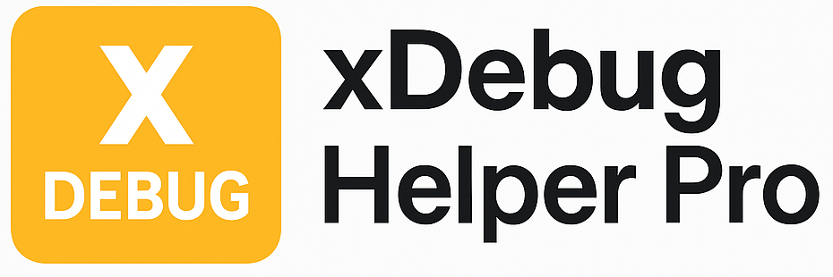

<div align="center">
  
  <h1>xDebug Pro</h1>
  <p><em>Toggle Xdebug sessions from your browser toolbar. 100% local, no tracking, open source.</em></p>
</div>

A modern Chrome extension (Manifest V3) for managing [Xdebug](https://xdebug.org/)
sessions with IDE profiles and per-domain state. It lets PHP developers enable or
disable Xdebug debugging directly from the browser toolbar, with support for
multiple IDEs and custom session keys — no bookmarklets, no server config changes.

## Features

- 🔄 Enable/disable Xdebug sessions with a single click
- 🛠️ IDE profiles: **PHPStorm**, **VS Code**, or **custom** session keys
- 🎛️ Debug / Profile / Trace modes (sets `XDEBUG_SESSION`, `XDEBUG_TRIGGER`,
  `XDEBUG_PROFILE`, `XDEBUG_TRACE` cookies as appropriate)
- 🌐 Per-domain state — each site remembers its own toggle, profile and mode
- 🟠 Toolbar badge shows the active mode (**D**/**P**/**T**) per tab
- 🔐 Strict Content Security Policy, minimal permissions
- 🔒 Privacy-focused: no data collection, no network calls, works entirely offline

See [SECURITY.md](./SECURITY.md) and [PRIVACY.md](./PRIVACY.md).

## Tech stack

Manifest V3 · Vue 3 + Vite 6 · TypeScript · Tailwind CSS ·
`webextension-polyfill` · Chrome `cookies` / `storage` / `tabs` / `webNavigation` APIs.

## Development

### Prerequisites

- Node.js 18+ and npm 9+
- Chrome

### Setup

```bash
git clone https://github.com/theconcept-technologies/xdebug-pro-extension.git
cd xdebug-pro-extension
npm install
```

### Build & load in Chrome

```bash
npm run build            # tsc + vite → dist/
```

1. Open `chrome://extensions` and enable **Developer mode** (top right).
2. Click **Load unpacked** and select the `dist/` folder.
3. The xDebug Pro icon appears in your toolbar.

`npm run dev` runs Vite for fast UI iteration, but extension APIs
(`cookies`, `tabs`, …) only work in the loaded `dist/` build.

Available scripts:

- `npm run build` — type-check and build to `dist/`
- `npm run dev` — Vite dev server (UI only)
- `npm run lint` — ESLint
- `npm run generate-icons` — regenerate PNG icons from the SVG sources
- `npm run release[:patch|:minor|:major]` — bump version, build, and zip
  `dist/` to `xdebug-pro-vX.Y.Z.zip`, then commit, tag and push

## Usage

1. Click the xDebug Pro icon in the toolbar.
2. Pick your IDE profile (PHPStorm, VS Code, or custom).
3. Toggle Xdebug on for the current domain; the badge shows the active mode.
4. Reload the page — the request now carries the Xdebug cookie so your IDE
   picks up the session. Toggle off to clear it.

Preferences are stored per domain in `chrome.storage.local`.

## Security

- **Strict CSP** on extension pages:
  `script-src 'self'; object-src 'self'; base-uri 'self'` — no inline scripts,
  no remote code, no `eval`.
- **No network calls, no tracking, no analytics.** All code ships in the package.
- **Minimal permissions**, each justified in [PRIVACY.md](./PRIVACY.md).
- Cookies are set and cleared locally via the browser `cookies` API only.

## Project structure

```
xdebug-pro-extension/
├── src/
│   ├── manifest.json         # MV3 manifest (source of truth)
│   ├── background.ts         # Service worker (icon/badge + cookie sync)
│   ├── popup.ts / popup.html # Popup entry
│   ├── components/           # Vue 3 SFCs (Popup, DebugHelp, SponsorOverlay)
│   ├── utils/                # cookie / storage helpers
│   └── types.ts
├── public/                   # Static assets
├── scripts/                  # icon generation + release tooling
├── dist/                     # Build output (git-ignored)
└── ...config files
```

## Contributing

Contributions are welcome — fork, branch, and open a PR. Please keep the existing
code style and update docs as needed. See [CONTRIBUTING.md](./CONTRIBUTING.md).

## License

MIT License — see [LICENSE](./LICENSE).

## Acknowledgments

- [Xdebug](https://xdebug.org/) — the PHP debugger this extension drives
- [Chrome Extensions documentation](https://developer.chrome.com/docs/extensions/)

## ☕ Support us

If you find this useful, consider supporting continued development:

- [☕ Buy Me a Coffee](https://buymeacoffee.com/theconcepttechnologies)
- [💜 GitHub Sponsors](https://github.com/sponsors/theconcept-technologies)

Every bit helps us maintain and improve this tool. — [theconcept technologies](https://theconcept-technologies.com)
